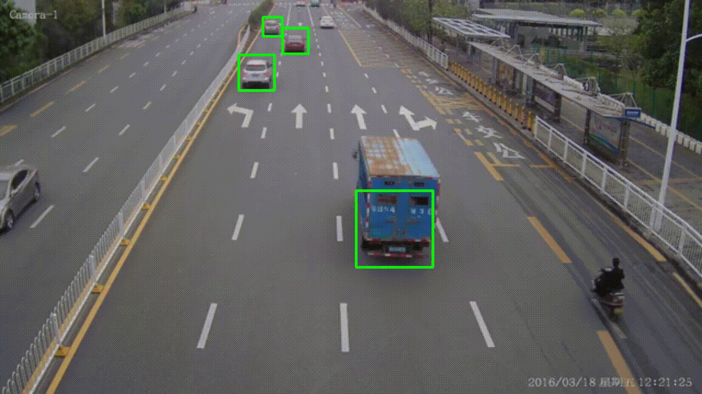

# Vehicle Speed Detection

Technologies used :
- Python
- opencv
- dlib
 

Tasks breakdown
1. Vehicle Detection
    - We are using Haarcascade classifier to identify vehicles.
2. Vehicle Tracking - ( assigning IDs to vehicles )
    - We have used corelation tracker from dlib library.
3. Speed Calculation
    - We are calculating the distance moved by the tracked vehicle 
		  in a second, in terms of pixels, so we need pixel per meter
		  to calculate the distance travelled in meters.
	- With distance travelled per second in meters, we will get the 
		  speed of the vehicle.

#### How to run project? 

Follow steps:

1. Clone repo :
`git clone https://github.com/kraten/vehicle-speed-check`

2. cd (change directory) into vehicle-speed-check
`cd vehicle-speed-check`

3. Create virtual environment
`python -m venv venv`

4. Activate virtual environment
`./venv/bin/activate`

5. Install requirements
`pip install  -r requirements.txt`

6. run speed_check.py script
`python speed_check.py`

### Pull requests are welcome
